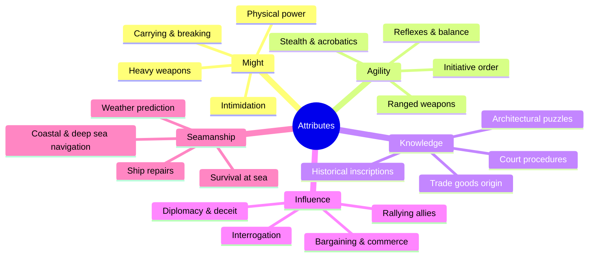
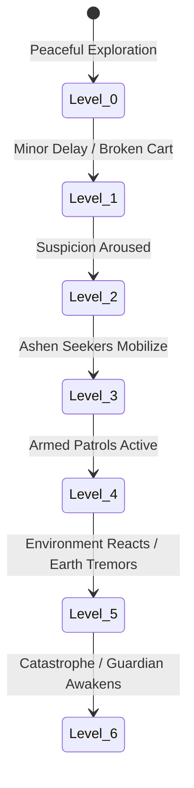
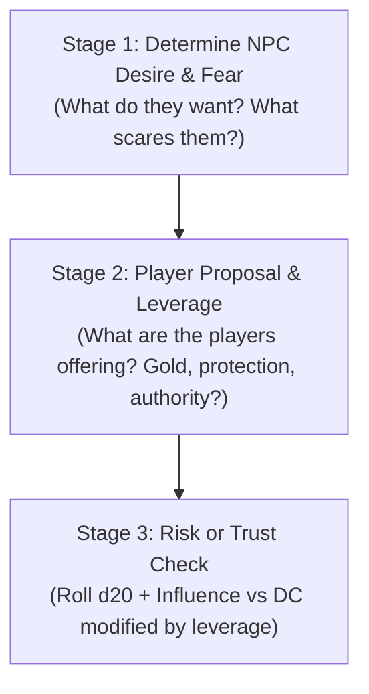
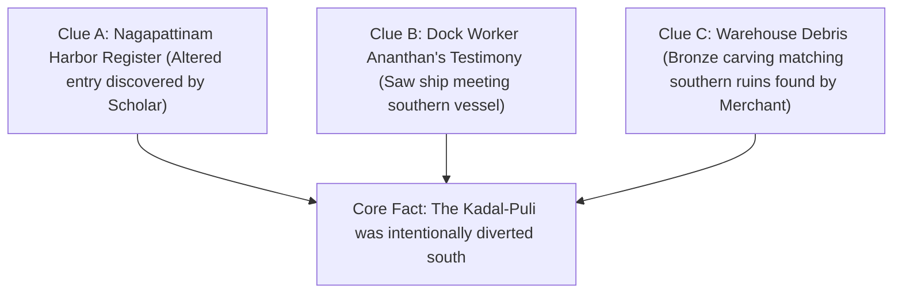

# Game Rules & Deterministic Mechanics
## SutraDhar: Chola AI-TTRPG Companion Engine

| Rulebook Version | Core System | Target Party Size | Target Session Length |
| :--- | :--- | :--- | :--- |
| **v1.0.0** | SutraDhar d20 Engine | 4 Players + 1 Game Master (or Solo AI) | 20–40 Minutes (5–10 Min Demo) |

---

## 1. Core Philosophy: Deterministic Rules, Adaptive Story

In SutraDhar, **the rules are absolute, transparent, and deterministic**.
- **Player Decision Agency**: All decisions are made **exclusively by the human players through natural table dialogue, debates, and roleplay**. The AI never dictates, automates, or selects what the party decides to do.
- **Zero Digital Dice Rolling**: The companion app **contains no digital dice rollers**. Dice are never rolled on a screen.
- **Physical Dice for Action Resolution**: When a player takes a risky or uncertain action, the player rolls a **physical d20 die onto the table**. The resulting number is spoken aloud, parsed by the speech engine, and validated against the target DC.
- **Dialogue-Driven Resolution**: Everyday decisions (where to travel, how to divide supplies, what to say to an official, whether to help an NPC) are resolved through **pure spoken conversation**, not dice rolls.
- **Deterministic Bounds**: Health totals, supply counts, threat clocks, and inventory are governed by hard mathematical boundaries. The AI Game Master provides atmospheric description, roleplays NPCs, and reflects consequence, but **it cannot silently modify stats, override player agency, or invent rules**.
- **Failure is Momentum**: A failed physical check never produces an empty "nothing happens" dead end. It always costs resources, burns time, escalates Threat, or creates an alternative complication.

---

## 2. Core Resolution Engine (d20 Checks)

When a player attempts an action where the outcome is uncertain and failure carries meaningful consequences, the player rolls a physical 20-sided die (d20).

$$\text{Check Result} = \text{Physical d20 Roll} + \text{Attribute Modifier} + \text{Situational Bonuses}$$

$$\text{Success Condition} = \text{Check Result} \ge \text{Target Difficulty Class (DC)}$$

### 2.1 Standard Difficulty Classes (DC)

| Difficulty Level | Target DC | Typical Context in 11th-Century Chola |
| :--- | :--- | :--- |
| **Easy** | **DC 8** | Spotting obvious port cargo, speaking basic Tamil/local dialects, navigating calm inland canals. |
| **Routine Under Pressure** | **DC 11** | Interrogating a nervous dock clerk, repairing a boat during rain, striking an unprepared thug. |
| **Difficult** | **DC 14** | Deciphering ancient Grantha temple script, tracking through muddy forest, dodging a spear trap. |
| **Very Difficult** | **DC 17** | Sailing through a monsoon squall, persuading an armed mercenary leader, inspecting damaged ship hulls. |
| **Exceptional** | **DC 20** | Pacifying the ancient Ashen Guardian without the seal, spotting an erased line in imperial court registers. |

### 2.2 Critical Rolls
- **Natural 20 (Critical Success)**: The intended action succeeds with extraordinary flair. The GM/AI grants an immediate secondary benefit (e.g., bonus clue revealed, 0 Supplies consumed, +1 NPC Trust).
- **Natural 1 (Critical Complication)**: The action fails with a sharp complication regardless of modifiers (e.g., weapon damaged, Threat Clock immediately ticks $+1$, or an NPC turns Hostile).

### 2.3 Advantage, Disadvantage, and Group Checks
- **Advantage (+2 Modifier)**: Awarded when a player uses an ideal tool, plans ahead, or cites authentic historical context from the Rulebook.
- **Disadvantage (-2 Modifier)**: Imposed when operating in complete darkness, under severe injury, or in deep water without maritime training.
- **Group Checks**: For actions undertaken as a full party (e.g., sneaking past guards or surviving a storm), the players nominate the single character with the highest relevant stat to lead, while one ally may **Assist** (granting a flat $+2$ bonus). The party avoids rolling 4 separate times for simple group tasks.

---

## 3. The 5 Core Attributes

Every character is defined by five specialized attributes:



---

## 4. The Resource & State Economy

The party shares and manages four deterministic resource pools that constrain their choices.

```
+-----------------------------------------------------------------------------------+
|                               PARTY RESOURCE POOLS                                |
+----------------------+----------------------+----------------------+--------------+
|     HIT POINTS       |      SUPPLIES        |        GOLD          | THREAT CLOCK |
| Character-specific   | Shared Party Pool    | Shared Party Pool    | Shared Track |
| Kavalan: 14 | Vetan: 11 | Initial: 8 Units     | Initial: 3 Coins     | 0 to 6 Scale |
| Scholar: 9  | Trader: 10 | Consumed by travel   | Used for bribes,     | Ticks up on  |
| 0 HP = Incapacitated | and resting          | purchases, repairs   | failures     |
+----------------------+----------------------+----------------------+--------------+
```

### 4.1 Hit Points (HP) & Incapacitation
- **No Instant Death**: To keep the tabletop prototype engaging and avoid player elimination, reaching **0 HP** means the character is **Incapacitated** (unconscious or gravely injured).
- **Incapacitated State**: An incapacitated character cannot take actions until stabilized by an ally spending 1 Supply or succeeding on a DC 11 Knowledge/Might check.

### 4.2 Supplies
- Represents fresh water, dried rice, dried fish, rope, lamp oil, and travel gear.
- **Travel Cost**: Moving between major connected nodes on the battlemap consumes **1 Supply** (or **2 Supplies** for stormy sea routes).
- **Depletion**: If the party reaches **0 Supplies**, all future checks suffer **Disadvantage (-2)** due to exhaustion and hunger.

### 4.3 Gold (Kasu)
- Authentic stamped Chola currency used to bribe harbour officials, hire local catamarans, or purchase trade goods.

### 4.4 The Threat Clock (0 to 6)
The Threat Clock represents escalating danger, enemy mobilization, and supernatural disturbance:



- **Threat 0–1**: The world is quiet. NPCs are relaxed.
- **Threat 2–3**: Mercenaries are actively looking for the party; NPCs become wary of being seen with outsiders.
- **Threat 4–5**: Armed ambushes occur on roads; temple ruins shake and stones crumble.
- **Threat 6**: Complete escalation! The Ashen Guardian awakens in full combat fury, or the ruins begin an irreversible collapse.

---

## 5. Action System & Combat Engine

SutraDhar treats combat as a dangerous, tense event rather than the primary activity of the game. Most conflicts allow stealth, negotiation, or tactical retreat.

### 5.1 Turn Order & Initiative
When combat begins, each participant rolls $\text{d20} + \text{Agility}$. Characters act in descending order of their total result.

### 5.2 Turn Action Economy
On their turn, a character may take:
1. **Movement**: Move to an adjacent tactical zone (e.g., from the doorway to the central pedestal).
2. **One Major Action**:
   - **Attack**: Strike an enemy within range.
   - **Defend**: Enter a defensive stance ($+2$ to personal Defense until next turn).
   - **Assist**: Grant $+2$ to an ally’s upcoming action.
   - **Interact**: Pick up the bronze seal, open a chest, or trigger a stone mechanism.
   - **Use Class Ability**: Spend Stamina or Insight to activate a unique power.
   - **Flee / Disengage**: Attempt to escape combat (requires DC 11 Agility check).

### 5.3 Combat Resolution Math
- **Attack Roll**: $\text{d20} + \text{Might (Melee)}$ OR $\text{d20} + \text{Agility (Ranged)}$ vs **Target Defense**.
- **Enemy Defense**: Common mercenaries have Defense **11–13**. Elite Ashen Seekers have Defense **14–15**. The Ashen Guardian has Defense **17**.
- **Weapon Damage Formulas**:
  - *Chola Spear*: $1\text{d6} + 1$ damage.
  - *Composite Bow*: $1\text{d6}$ damage.
  - *Hunting Knife / Dagger*: $1\text{d4}$ damage.
  - *Guardian Stone Slam*: $1\text{d6} + 2$ damage.

---

## 6. Social Encounter System

Social encounters are structured into a deterministic **3-Stage Conversation Framework**:



### 6.1 NPC Trust States
NPCs transition across 5 discrete relationship tiers:

| Trust Tier | Mechanical Impact on Tabletop Play |
| :--- | :--- |
| **Hostile** | Refuses conversation. Attacks or alerts guards immediately. Requires exceptional DC 17 check to de-escalate. |
| **Wary** | Answers questions with half-truths. Demands Gold or proof of authority before sharing clues. |
| **Neutral** | Polite but cautious. Willing to trade goods at standard prices; shares common rumors. |
| **Helpful** | Volunteers hidden information. Warns the party of upcoming ambushes or traps. |
| **Allied** | Provides active physical or nautical assistance. Will fight alongside the party or offer shelter. |

### 6.2 Influence is Not Mind Control
A successful Influence check cannot compel an NPC to commit suicide or betray their deepest convictions. It only guarantees that the NPC responds favorably within the boundaries of their personal self-interest.

---

## 7. Investigation & The 3-Clue Redundancy Rule

To prevent mystery bottlenecks, SutraDhar enforces the **Three-Clue Rule**:

> *For any critical mystery conclusion the players must reach, there must be at least THREE independent clues pointing to it.*

### Example: The Diverted Ship Mystery



If the party completely misses or ignores Clue A, Clues B and C remain fully discoverable through alternative routes.

---

## 8. Failure Consequence Tables ("Fail Forward")

| Action Category | Outcome of Failed Check | Consequence on Game State |
| :--- | :--- | :--- |
| **Combat Check** | Attack misses or glancing blow. | Attacker takes 1d4 counter-damage or loses tactical position. |
| **Investigation Check** | Clue is found, but at a cost. | Player discovers the document, but accidentally damages it, takes double time, or burns 1 Supply. |
| **Influence Check** | NPC remains unconvinced or offended. | NPC Trust drops one level (e.g. Neutral $\rightarrow$ Wary) or demands a 1 Gold bribe. |
| **Navigation Check** | Ship veers into rough coastal currents. | Vessel sustains minor hull damage; party loses 1 Supply; Threat ticks $+1$. |
| **Stealth Check** | Snapped twig or torchlight glint. | Enemies gain surprise round or prepare an ambush position. |
