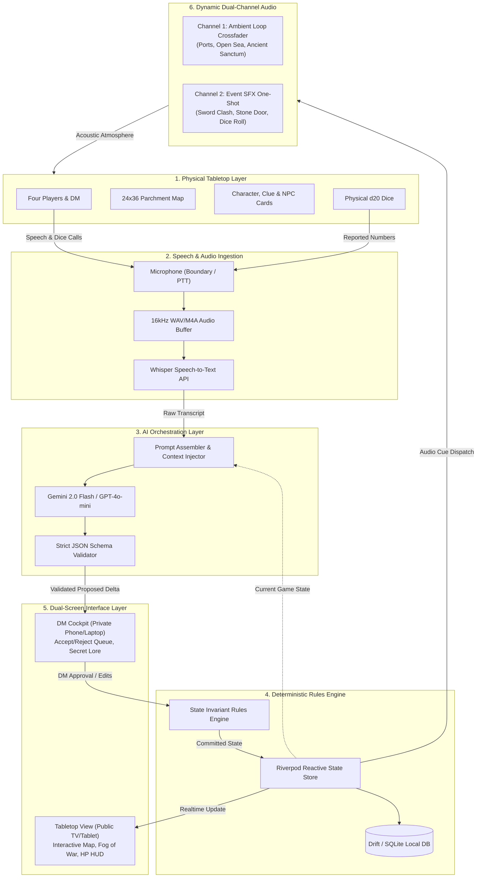
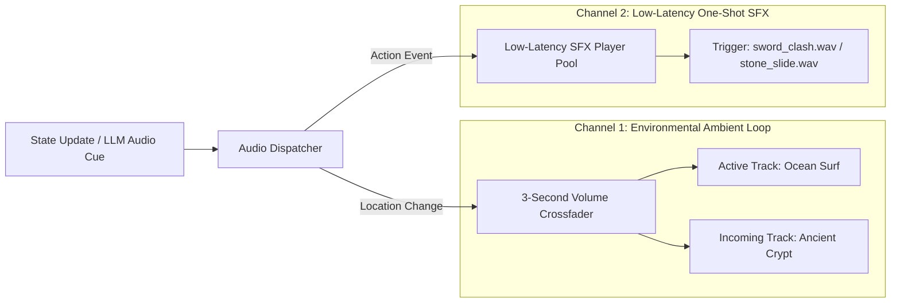
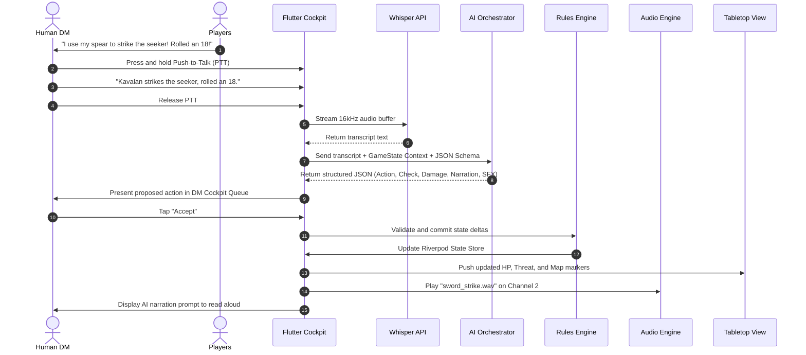

# High-Level Design (HLD)
## SutraDhar: Chola AI-TTRPG Companion Engine

| Document Version | Architectural State | Author | Target Campaign |
| :--- | :--- | :--- | :--- |
| **v1.0.0** | Production Baseline | SutraDhar Core Architecture | The Lost Ship (11th-Century Chola) |

---

## 1. System Architecture Overview & Macro-Topology

**SutraDhar** operates on an asymmetrical hybrid physical-digital topology. The physical table hosts the players, dice, battlemap, and physical cards. The digital system provides real-time state tracking, acoustic orchestration, rules validation, and AI-driven narrative co-piloting.

### 1.1 End-to-End System Flow Diagram

---

## 2. Core Subsystems & Decomposition

### 2.1 Subsystem A: Speech-to-State Audio Pipeline
The audio pipeline captures natural table dialogue and extracts structured in-game intent without requiring tedious touchscreen data entry.
1. **Audio Recording**: The DM Cockpit captures microphone input either via an explicit **Push-to-Talk (PTT)** button or an adaptive Voice Activity Detection (VAD) buffer.
2. **Audio Pre-processing**: 16kHz mono audio is normalized and compressed to reduce network payload.
3. **Speech Transcription**: The audio buffer is streamed to OpenAI Whisper (or an on-device Whisper model) returning a raw text string (e.g., *"Kavalan attacks the mercenary with his spear and rolls a 16"*).
4. **Latency Budget**: Audio capture to raw text transcript must execute within $\le 1,200\text{ ms}$.

### 2.2 Subsystem B: AI Orchestration & Semantic Extraction Layer
The AI layer serves as a semantic parser and atmospheric narrator.
- **Context Injection**: The prompt assembler compiles:
  1. The canonical timeline of *The Lost Ship* (fixed truth).
  2. The current structured game state (`location: "coastal_village"`, `threat: 2`, `supplies: 6`, `characters: [...]`).
  3. Active NPC dispositions and unrevealed clues.
  4. The raw transcribed dialogue.
- **Structured Tool Calling / JSON Conformance**: The LLM is forced to output structured JSON strictly matching the `GameStateDelta` schema. Unstructured free-form text output is rejected.
- **Anti-Hallucination Guardrails**:
  - The model is strictly prohibited from altering character stats beyond valid rule boundaries.
  - The model cannot invent historical facts contrary to the curated historical codex.
  - Required mystery clues cannot be permanently destroyed or omitted.

### 2.3 Subsystem C: Deterministic Rules & Validation Engine
The rules engine maintains mathematical integrity and game balance:
- **Separation of Concerns**: The AI *proposes* state changes; the rules engine *enforces* them.
- **State Invariants**:
  - A character's HP cannot exceed their maximum HP.
  - If a character reaches 0 HP, their status automatically transitions to `Incapacitated`.
  - The Threat Clock is clamped between `0` and `6`.
  - Supplies and Gold cannot drop below `0`.
  - If an action requires a skill check (e.g., DC 14 Agility), the rules engine evaluates `dice_roll + attribute_modifier >= DC`.

### 2.4 Subsystem D: Reactive State Management (Riverpod)
The application utilizes Flutter Riverpod for unidirectional data flow:
- All game entities are modeled as immutable Dart data classes (`GameState`, `Character`, `LocationState`, `ThreatTracker`).
- Unidirectional state modifications are dispatched through `StateNotifier` / `Notifier` controllers.
- Subscribed UI widgets selectively rebuild only when their specific slice of state changes, ensuring 60 FPS performance on modest tablets.

### 2.5 Subsystem E: Dual-Screen Architecture
The system supports two independent visual displays:

| Display | Form Factor | Audience | Primary Responsibilities |
| :--- | :--- | :--- | :--- |
| **DM Cockpit** | Mobile Phone / Laptop | Human Game Master | - Pending AI action queue (Accept / Reject / Edit) - Hidden NPC motives & secret historical notes - Manual state overrides (HP, Threat, Supplies) - PTT Audio capture button |
| **Tabletop View** | Tablet / TV Screen | Players at Table | - High-resolution interactive parchment map - Fog-of-War uncovering active regions - Public Party HUD (Character tokens, HP bars, Threat Clock) - Atmospheric thematic artwork |

- **Communication Protocol**:
  - *Phase 1–3 (Single Device / External Display)*: Flutter multi-window or HDMI/Cast presentation mode.
  - *Phase 4 (Multi-Device)*: Local network WebSocket server (zero cloud dependency) or cloud-based Supabase Realtime synchronization.

### 2.6 Subsystem F: Dynamic Dual-Channel Audio Engine
The audio architecture utilizes Flutter’s `just_audio` and `audio_session` packages to run two independent, concurrent audio pipelines:

- **Ambient Channel**: Loops seamlessly without clicks. Transitions smoothly fade out the previous location's ambient track while fading in the new track over a 3.0-second window.
- **SFX Channel**: Dedicated pre-buffered player pool providing sub-150ms playback of impacts, dice rolls, whispers, and supernatural resonance.

### 2.7 Subsystem G: Data Persistence & Session Journaling
- **Local Database**: Built on **Drift** (type-safe SQLite for Dart).
- **Session Journaling**: Every player check, DM modification, and discovered clue is appended to an immutable `EventLog` table.
- **Undo / Rollback**: The DM can roll back game state to any previous turn in case of player misunderstanding or accidental input.
- **Zero-Cloud Guarantee**: All campaign progress, characters, and rules are stored locally, guaranteeing full offline operability.

---

## 3. High-Level Data Flow Sequence

---

## 4. Architectural Resilience & Failure Modes

| Potential Failure Point | Architectural Mitigation Strategy |
| :--- | :--- |
| **No Internet Connection** | The app falls back immediately to Manual DM Mode. The human DM inputs dice and actions via quick-touch buttons. Drift database works 100% offline. |
| **LLM Schema Parsing Error** | If the LLM returns invalid JSON or hallucinates keys, the schema validator intercepts it, generates a structured error log, and prompts the DM with a simple manual check resolution box. |
| **Microphone Background Noise** | Boundary microphone filtering + VAD threshold tuning. The DM always reviews transcripts in the Cockpit before approving state mutations. |
| **Audio Playback Interruption** | `audio_session` manages audio interruptions (phone calls, OS audio focus). Ambient playback automatically resumes once focus is regained. |
