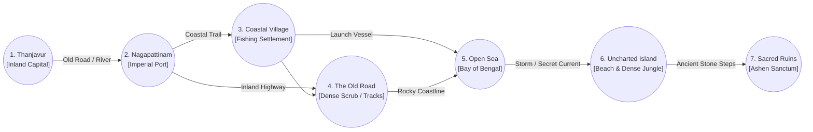

# Low-Level Design (LLD) — Hardware & Physical Components
## SutraDhar: Chola AI-TTRPG Companion Engine

| Document Version | Physical Spec State | Target Material | Fabrication Tier |
| :--- | :--- | :--- | :--- |
| **v1.0.0** | Print & Fabrication Ready | 350 GSM Heavy Matte / Neoprene | Physical Tabletop Prototype |

---

## 1. Physical Tabletop Philosophy & Spatial Setup

SutraDhar is designed from the ground up as a **physical-first tabletop experience**. The screen is never placed between players as a visual wall; instead, the physical parchment map and tactile cards occupy the center of the table, while the digital companion app operates ambiently on the perimeter.

### 1.1 Physical Tabletop Ergonomic Layout

```
                                  [TABLETOP VIEW SCREEN]
                                (Tablet / TV facing Players)
                                              |
      [Player 1: Kavalan]                     |                    [Player 2: Vēṭan]
    +----------------------+                  v                  +----------------------+
    | Physical Card & HP   |       +---------------------+       | Physical Card & HP   |
    | Dice Rolling Tray    |       |   24" x 36" MAP     |       | Dice Rolling Tray    |
    +----------------------+       |  Thanjavur -> Sea   |       +----------------------+
                                   |  Nodes & Tokens     |
      [Player 3: Vāṇiyan]          +---------------------+         [Player 4: Kalviyalār]
    +----------------------+                  ^                  +----------------------+
    | Physical Card & HP   |                  |                  | Physical Card & HP   |
    | Dice Rolling Tray    |       [BOUNDARY MICROPHONE]         | Dice Rolling Tray    |
    +----------------------+                  ^                  +----------------------+
                                              |
                                     [HUMAN GAME MASTER]
                                 [DM Cockpit Phone / Laptop]
```

---

## 2. The Battlemap Physical Specifications

The physical battlemap is the tactical and navigational anchor of *The Lost Ship*. It represents the historical Coromandel Coast and the Bay of Bengal during the 11th-century Chola Empire.

### 2.1 Dimensions & Material Specifications
- **Size**: 24 inches wide by 36 inches long ($61\text{ cm} \times 91.4\text{ cm}$).
- **Substrate Options**:
  - *Tier 1 (Prototyping)*: 180 GSM natural kraft poster paper with aged parchment aesthetic.
  - *Tier 2 (Production)*: 2mm stitched-edge water-resistant neoprene playmat with non-slip natural rubber backing.
- **Visual Aesthetic**: Hand-inked Chola cartography, antique Tamil/Grantha calligraphy annotations, rhumb lines, compass rose indicating seasonal monsoon winds, and sea beast illustrations inspired by medieval Indian Ocean trade lore.

### 2.2 Regional Nodes & Gridless Topology
The map does not use a rigid 1-inch tactical grid. Instead, it uses **Point-to-Point Node Topology**:



| Node ID | Location Name | Tactical Footprint | Physical Token Placement |
| :--- | :--- | :--- | :--- |
| **NODE-01** | **Thanjavur** | $120\text{ mm}$ circular illustration | Brihadisvara-style gopuram illustration, court briefing zone. |
| **NODE-02** | **Nagapattinam** | $140\text{ mm}$ circular port basin | Harbor docks, warehouses, merchant ships anchored at mouth of river. |
| **NODE-03** | **Coastal Village** | $100\text{ mm}$ oval settlement | Stilted fishing huts, damaged wooden catamarans on the beach. |
| **NODE-04** | **The Old Road** | $80\text{ mm}$ winding trail icon | Abandoned carts, dense scrubland, muddy tracking ground. |
| **NODE-05** | **Open Sea** | $250\text{ mm}$ oceanic expanse | Rhumb lines, wave textures, squall storm hazard markers. |
| **NODE-06** | **The Island** | $120\text{ mm}$ irregular landmass | Rocky reef barriers, dense tropical canopy, beach landing. |
| **NODE-07** | **The Sacred Ruins** | $100\text{ mm}$ stone terrace | Massive Dravidian monoliths, central pedestal indentation. |

---

## 3. Physical Character Reference Cards

Each player holds a tactile, heavyweight character reference card.

### 3.1 Dimensions & Substrate
- **Dimensions**: $4.0\text{ in} \times 6.0\text{ in}$ ($101.6\text{ mm} \times 152.4\text{ mm}$) standard index / oversized tarot format.
- **Paper Stock**: 350 GSM heavyweight cardstock with soft-touch matte lamination and rounded corners (3mm radius).

### 3.2 Card Layout & Tracker Slots
```
+-------------------------------------------------------------+
| [ROLE ICON]  KAVALAN (THE GUARDIAN)                 HP: 14  |
| "The Bronze Shield of the Coromandel Coast"                 |
+-------------------------------------------------------------+
| ATTRIBUTES (2d6 Modifiers):                                 |
| [MIGHT: +5]  [AGILITY: +3]  [KNOWLEDGE: +1]                |
| [INFLUENCE: +2]  [SEAMANSHIP: +2]                           |
+-------------------------------------------------------------+
| ACTIVE ABILITIES:                                           |
| * GUARD: Once per combat round, intercept an attack         |
|   directed at an adjacent ally within arms reach.           |
| * POWERFUL STRIKE: Spend 1 Stamina to gain +3 on any       |
|   Might combat check.                                       |
+-------------------------------------------------------------+
| STARTING EQUIPMENT & SLOTS:                                 |
| - Bronze-Tipped Chola Spear (1d6+1 damage)                  |
| - Heavy Teak Shield (+2 to personal Defense)                |
| - Travel Cloak & Rations (2 Stamina tokens)                 |
+-------------------------------------------------------------+
| HP TRACKER (Side Rail):                                     |
| [14][13][12][11][10][09][08][07][06][05][04][03][02][01][00]|
+-------------------------------------------------------------+
```
- **Side Rail HP Tracker**: The right or bottom margin features numbered boxes (14 to 0). Players use a mini acrylic slide clip or wooden cube marker to physically track health without writing or erasing.
- **Stamina / Insight Well**: Circular indentations on the card face hold physical acrylic stamina/insight beads.

---

## 4. Physical Cards Hierarchy

Physical cards are handed out by the human Game Master or drawn by players upon specific triggers.

### 4.1 Clue Cards ($2.5\text{ in} \times 3.5\text{ in}$ Poker Size, Linen Finish)
1. **CARD-CLUE-01: Altered Shipping Register**:
   - *Visual*: Aged palm-leaf document facsimile.
   - *Flavor*: *"Nagapattinam Port Authority ledger showing erased destination coordinates for the Kadal-Puli."*
   - *Mechanic*: Unlocks direct navigation to Coastal Village.
2. **CARD-CLUE-02: Bronze Metal Fragment**:
   - *Visual*: Illustrated corroded bronze carving featuring ancient geometric spirals.
   - *Mechanic*: Scholar (Kalviyalār) can inspect for $+2$ on island ruin lore.
3. **CARD-CLUE-03: Captain's Waterlogged Journal**:
   - *Visual*: Weathered parchment with ink stains.
   - *Flavor*: *"...the guardian did not stir until our hands touched the pedestal..."*
   - *Mechanic*: Decisive clue revealing the non-combat pacification route.

### 4.2 NPC Dossier Cards ($2.5\text{ in} \times 3.5\text{ in}$)
- **Muthu (Fisherman)**: Starting Trust: *Wary*. Needs his catamaran repaired.
- **Ananthan (Harbor Clerk)**: Starting Trust: *Fearful*. Possesses the secret cargo manifests.
- **Sembiyan Arul (Leader of Ashen Seekers)**: Starting Trust: *Pragmatic / Armed Neutral*. Open to negotiation if players demonstrate superior leverage.
- **The Ashen Guardian**: Ancient stone-metal construct. Hostile only when the sanctum is violated.

### 4.3 Encounter & Hazard Cards
- **CARD-ENC-01: The Broken Merchant Cart**: Roadside social opportunity.
- **CARD-ENC-02: Monsoon Squall**: Sea hazard requiring Seamanship checks.
- **CARD-ENC-03: Ambush in the Scrub**: Tactical combat encounter on the Old Road.

---

## 5. Dice & Token Specifications

### 5.1 Dice Standards
- **Core Dice**: Two standard six-sided dice (**2d6**) per player.
- **Resolution Scoring**: Check Result = $(\text{Die}_1 + \text{Die}_2) + \text{Attribute Modifier} + \text{Situational Bonus}$.
- **Visuals**: Antique bone, carved sandalwood, or polished sandstone cubic dice with deep-etched black or gold pips/numerals.
- **Rolling Trays**: 8" octagonal felt/leather rolling trays to eliminate dice bouncing off the table and dampen noise for the boundary microphone.

### 5.2 Physical Tokens & Markers
- **Party Movement Token**: 30mm brass ship token representing the group’s shared location on the battlemap.
- **Character Tokens**: 25mm laser-cut hardwood tokens with engraved class insignias.
- **Supply Tokens**: 20mm miniature burlap sack wooden tokens (Total in box: 20).
- **Gold Coins**: 22mm stamped metal Chola Kasu replicas featuring the dynastic tiger and twin fish emblem (Total: 25).
- **Threat Track Board & Token**: A separate $3\text{ in} \times 8\text{ in}$ cardboard strip numbered 0 through 6, with a red acrylic skull or flame token moved by the GM whenever Threat rises.

---

## 6. The Physical Rulebook & "Historical Codex" Mechanic

### 6.1 The Rulebook as an Artifact
The physical rulebook is formatted as a leather-bound folio titled **The Maritime Register of the Chola Admiralty**. It combines deterministic game rules with authentic 11th-century historical documentation.

### 6.2 The "Historical Reference" Game Mechanic
To merge education with tactical gaming:
- If a player encounters a challenge (e.g., navigating rough seas or negotiating port customs) and cites an authentic historical passage from the Rulebook's historical section (e.g., citing the *Ainnurruvar* trade charter or traditional *Marakkalam* outrigger handling), the AI GM companion awards **Advantage (+2 bonus on the check)** or reveals a secondary hidden clue.
- This creates genuine player excitement to read and understand Chola history during play without feeling like a school test.

---

## 7. Audio & Device Hardware Integration

### 7.1 Tabletop Microphone Guidelines
- **Placement**: A boundary USB/Bluetooth conference microphone (e.g., Anker PowerConf, Jabra Speak) placed at the center edge of the battlemap.
- **Acoustic Optimization**: Felt rolling trays and matte cards minimize clatter, ensuring that Whisper STT receives clean speech transcripts without clipped words.

### 7.2 Ambient Audio Speaker
- **Type**: 360-degree omnidirectional Bluetooth speaker positioned underneath or immediately beside the gaming table.
- **Function**: Emits low-frequency environmental rumble (ocean waves, temple drones) through the table surface, giving players a tactile acoustic sensation.

### 7.3 Device Stands & Ergonomics
- **Player Screen**: 10" or 12" tablet on a 45-degree angled stand at the head of the table running the **Tabletop View**.
- **DM Screen**: Smartphone or compact laptop positioned privately behind a miniature wooden GM screen running the **DM Cockpit**.
