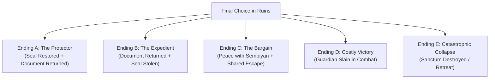

# The Lost Ship: Campaign Bible & Narrative Framework
## A Chola-Era Tabletop RPG Adventure

| Adventure Version | Campaign Arc | Setting Period | Canonical Truth |
| :--- | :--- | :--- | :--- |
| **v1.0.0** | 12-Chapter Narrative | 11th-Century Chola Empire (c. 1020 CE) | Fixed Truth, Flexible Routing |

---

## 1. Story Premise & Core Mystery

A state-commissioned Chola merchant vessel called the **Kadal-Puli** ("Sea Tiger") departed the imperial harbor of Nagapattinam carrying valuable trade goods and a **sealed royal court cylinder** destined for Thanjavur. Three days have passed since its scheduled arrival. The vessel has completely vanished.

The imperial administration summons four specialists—a frontline guardian, a tracker, an epigraphist scholar, and a merchant factor (or naval navigator/diplomat)—to quietly locate the ship, retrieve the royal cylinder, and determine what happened to the captain and crew.

---

## 2. The "Fixed Truth, Flexible Routing" Paradigm

The cardinal rule of SutraDhar is that **the underlying history of the world is fixed and unshakeable**. The AI Game Master never improvises random plotlines; instead, it adapts player choices to reveal this canonical timeline.

```
+-----------------------------------------------------------------------------------+
|                        THE CANONICAL UNDERLYING TIMELINE                          |
+-----------------------------------------------------------------------------------+
| 1. Centuries Ago: An ancient coastal/island sanctum was constructed. A guardian   |
|    construct (The Ashen Guardian) was bound to protect it via a sacred bronze Seal.|
|                                         |                                         |
| 2. Four Days Ago: The crew of the Kadal-Puli made an unscheduled stop on an       |
|    uncharted island, discovered the ruins, and pried the Bronze Seal loose.       |
|                                         |                                         |
| 3. Three Days Ago: Removing the Seal broke the binding wards. The Guardian awoke. |
|    Panicked, the crew fled to their vessel. The construct struck the ship as it   |
|    escaped, causing severe hull damage.                                           |
|                                         |                                         |
| 4. Two Days Ago: Limping along the coast during a storm, the ship ran aground.   |
|    Mercenaries known as the Ashen Seekers (led by Sembiyan Arul) heard rumors of   |
|    the discovered "treasure" and began hunting the crew and the artifact.         |
|                                         |                                         |
| 5. Present Day: The players are dispatched from Thanjavur to uncover the truth.  |
+-----------------------------------------------------------------------------------+
```

---

## 3. The 12-Chapter Scenario Walkthrough

---

### Prologue & Act I: The Thanjavur Briefing
- **Setting**: The quiet inner chamber of an imperial administrative building near the Brihadisvara temple complex in Thanjavur.
- **Scene Description**: The official rolls out a cloth map of the Coromandel coastline and slides an imperial wooden seal across the table.
- **Initial Strategic Choice**:
  - *Choice A (Supplies)*: Demand $+2$ extra Supplies. Consequence: Delay costs time; **Threat starts at 1**.
  - *Choice B (Authority)*: Request an Imperial Letter of Passage. Consequence: $+2$ Influence on royal officials, but smugglers become wary.
  - *Choice C (Swift Departure)*: Leave immediately with standard gear (8 Supplies, 3 Gold, Threat 0).
  - *Choice D (Interrogate Official)*: Roll Knowledge (DC 11) to ask about the crew; learn the navigator warned of strange lights south of the harbor.

---

### Chapter 1: The Road to Nagapattinam (The Broken Cart)
- **Setting**: The dusty royal highway winding east toward the Bay of Bengal through coconut groves and irrigation canals.
- **Encounter**: A spice merchant’s wooden cart has suffered a shattered wheel.
- **Player Choices**:
  - *Help Repair*: Kavalan rolls Might (DC 11). Costs 30 minutes; merchant shares rumor: *"Armed mercenaries from the south have been asking questions about an overdue ship."*
  - *Ignore*: Travel directly; arrive at port with zero time lost.

---

### Chapter 2: Nagapattinam Harbor Sandbox
- **Setting**: The bustling, noisy port basin crowded with merchant ships, foreign Arab and Srivijayan traders, and dock workers.
- **The 4 Investigative Nodes**:
  1. **Harbor Records Office**: Kalviyalār examines palm-leaf registers (Knowledge DC 11). Discovers the *Kadal-Puli*'s destination was secretly erased and altered southward.
  2. **The Dock Worker (Ananthan)**: Vēṭan spots an evasive clerk watching the docks (Agility DC 11). Under gentle questioning or 1 Gold bribe, Ananthan confesses: armed men threatened him to falsify the ship's course.
  3. **The Veteran Fisherman (Muthu)**: Vāṇiyan buys tea and talks to local fishers (Influence DC 11). Muthu reveals: *"Three nights ago, a ship limped south without lantern lights... but with a strange bronze glow."*
  4. **The Berth Warehouse**: Kavalan searches the abandoned storage area (Might DC 11). Finds bloodstained sailcloth and a discarded **Bronze Shaving** matching ancient temple metallurgy.

---

### Chapter 3: The Coastal Village
- **Setting**: A small stilted fishing hamlet south of Nagapattinam. Several catamarans are smashed on the beach.
- **Tension**: Five armed mercenaries (**The Ashen Seekers**) are intimidating local fishermen.
- **Branching Options**:
  - *Option 1 (Intervene & Defend)*: Kavalan steps in. DC 12 combat or DC 14 Thoodhuvar diplomacy. Rescuing the village makes Muthu’s family **Helpful**; they supply fresh fish and point out foot trails.
  - *Option 2 (Bargain with Seekers)*: Vāṇiyan speaks with the mercenary lieutenant. Learns they take orders from **Sembiyan Arul**.
  - *Option 3 (Circle Around via Stealth)*: Vēṭan rolls Agility (DC 11) to track footprints leading into the scrub forest.

---

### Chapter 4: The Old Inland Road
- **Setting**: An overgrown coastal road through thorny scrubland and ancient salt marshes.
- **Investigation**: Vēṭan identifies two overlapping sets of tracks: fleeing sailors followed closely by armed pursuers.
- **Discovery**: An abandoned campsite containing torn Chola uniforms and a waterlogged scrap of the **Captain's Journal**:
  > *"...the stone sanctum was not marked on any Chola chart... we should never have pried the seal from the pedestal..."*

---

### Chapter 5: The Ambush & Stand-Off with Sembiyan Arul
- **Encounter**: Sembiyan Arul emerges with three archers on the ridge.
- **Character Profile**: Sembiyan is a pragmatic veteran treasure hunter, not a mindless monster.
- **Dialogue & Resolution**:
  - *Fight*: Sembiyan has Defense 14, 18 HP. If reduced to 6 HP, he yields.
  - *Negotiate (Influence DC 14)*: Vāṇiyan points out that neither knows what the artifact actually does; proposes temporary truce to reach the wreck.
  - *Deceive (Influence DC 12)*: Convince Sembiyan the artifact was already recovered by the imperial navy.

---

### Chapter 6: The Wreck of the Kadal-Puli
- **Setting**: A rocky coastal cove where the torn wooden hull of the *Kadal-Puli* lies wedged against granite boulders.
- **Discoveries**:
  - *Hull Inspection (Seamanship DC 11)*: The planks were not crushed by rocks—they were smashed from above by an immense, blunt force.
  - *Captain's Quarters*: Inside an iron-bound locker, players recover the **Imperial Royal Court Cylinder** (Mission Objective 1 secured!).
  - *The Bronze Seal Fragment*: Lodged in the splintered deck is a heavy, ornate bronze disc inscribed with circular runes.

---

### Chapter 7: The Journey Across the Open Sea
- **Objective**: Sail to the uncharted island coordinate discovered in the captain's log.
- **Route Selection**:
  - *Route 1 (Safe Coastal Channel)*: Costs 2 Supplies. Calm waters, zero risk, but Threat ticks $+1$ due to time.
  - *Route 2 (Fast Monsoon Channel)*: Seamanship check (DC 14). Success: arrive in half the time. Failure: 1 Supply lost and 1d4 damage to vessel.
  - *Route 3 (Navigator's Hidden Current)*: Available if the Marakkalam Navigator is in the party. Bypasses all hazards with ease.
- **Event: The Floating Survivor**: The party spots a clinging sailor. Rescuing him costs 1 Supply, but he warns: *"Do not touch the pedestal... it only wants its seal returned!"*

---

### Chapter 8: The Uncharted Island
- **Setting**: A mist-shrouded island ringed by black volcanic reefs, dense jungle canopy, and complete silence.
- **Zones**:
  - *The Black Sand Beach*: Smashed rowboats and scattered trade barrels.
  - *The Jungle Path*: Overgrown stone pavers half-swallowed by banyan roots. Vēṭan detects tripwire traps left by previous crew.
  - *The Monolithic Steps*: Gigantic carved stone staircase leading up to a cliffside cavern entrance.

---

### Chapter 9: The Sacred Ruins (Ashen Sanctum)
- **Setting**: A colossal subterranean chamber carved from obsidian stone, lit by eerie phosphorescent lichen.
- **Focal Point**: At the center of the hall stands a carved basalt pedestal with a hollow circular depression matching the Bronze Seal.
- **Epigraphy Check (Kalviyalār Knowledge DC 12)**:
  > *"Bound by the Sun and Sea to stand silent vigil. Let no mortal hand sever the Seal, lest the Ashen Sentinel break the sleep of ages."*
- **Revelation**: The crew of the *Kadal-Puli* did not disappear due to piracy or storms; their greed awakened an ancient protector.

---

### Chapter 10: Climax — Awakening of the Ashen Guardian
- **The Trigger**: As players approach the pedestal, the ground trembles. From the shadows behind the altar, an 8-foot-tall construct of weathered stone and bronze awakens. Its hollow eyes burn with amber flame.
- **Encounter Mechanics**:
  - **The Guardian (Defense 16, HP 24)**: Deals $1\text{d6}+2$ damage. Resistant to mundane piercing arrows.
  - **The Peaceful Solution (Tactical Puzzle)**: Re-inserting the Bronze Seal into the central pedestal requires two successful actions: one character distracts/holds off the construct (Might DC 14), while another sprints to the pedestal and locks the seal into place (Agility DC 12).
  - **The Combat Solution**: Defeating the Guardian in physical battle. Requires coordinated teamwork (Kavalan guarding the Scholar while everyone attacks its joints).

---

### Chapter 11: Sembiyan Returns
- **Tension**: Just as the Guardian situation resolves, Sembiyan Arul and his surviving mercenaries enter the sanctum with drawn blades.
- **Sembiyan's Demand**: *"Hand over the bronze seal. That metal alone will buy a palace in Sri Lanka."*
- **Four Paths**:
  - *Path A (Convince Sembiyan - Influence DC 14)*: Explain the truth—the seal is not gold; it is an active trigger that will bring the cave down on all of them. Sembiyan withdraws peacefully.
  - *Path B (Fight)*: Decisive skirmish. Sembiyan is outmatched if the party is united.
  - *Path C (Trick Him)*: Hand him a fake bronze trade component from the ship’s cargo.
  - *Path D (Surrender the Seal)*: Hand him the real seal; the Guardian immediately awakens in berserk fury, collapsing the sanctum.

---

### Chapter 12: The Final Choice & 5 Narrative Endings



#### Ending A: The Protector (Canonical Good Ending)
- **Requirements**: Seal restored to pedestal; royal document recovered; Sembiyan convinced or defeated.
- **Epilogue**: The Guardian sinks back into silent slumber. The party returns to Thanjavur as heroes. The court rewards them with imperial patronage. The island remains untouched.

#### Ending B: The Expedient (Greed & Ambiguity)
- **Requirements**: Royal document recovered, but the party keeps the Bronze Seal to sell or study.
- **Epilogue**: The island sanctum collapses into the sea. The players return rich, but dark nightmares and supernatural portents follow them across the Coromandel coast (Hook for Adventure 2).

#### Ending C: The Bargain (Diplomatic Realism)
- **Requirements**: Sembiyan convinced to ally with the party; loot from the wreck shared; document returned.
- **Epilogue**: Both factions sail back together. Sembiyan becomes a valuable underworld contact for the party in future campaigns.

#### Ending D: The Costly Victory (Brute Force)
- **Requirements**: The Ashen Guardian is destroyed in combat; heavy casualties or near 0 HP for the party.
- **Epilogue**: The construct shatters into lifeless stone, but the ancient sanctum is defiled. The players complete the mission at a heavy physical and moral cost.

#### Ending E: Failure & Collapse (Tragic Flight)
- **Requirements**: The party flees without the document or seal as the cave collapses around them.
- **Epilogue**: The players barely escape on a wooden raft. The mystery remains buried beneath the waves. The royal court strips them of their commissions.

---

## 4. Major NPC Dossiers

### Sembiyan Arul (Leader of the Ashen Seekers)
- **Motivation**: Wealth, autonomy, escaping imperial debts.
- **Personality**: Calculating, cynical, respects courage, detests useless bloodshed.
- **Dialogue Voice**: Rough, measured Tamil with maritime slang.

### Muthu (Fisherman of the Coastal Village)
- **Motivation**: Protecting his family and village catamarans.
- **Personality**: Pious, weary, mistrusts court officials from Thanjavur.
- **Dialogue Voice**: Gentle, cautious, speaks with ocean metaphors.

### Ananthan (Nagapattinam Harbor Clerk)
- **Motivation**: Self-preservation.
- **Personality**: Nervous, easily intimidated, burdened by guilt over falsifying registers.
- **Dialogue Voice**: Rapid, stammering, apologetic.

### The Ashen Guardian (The Sanctum Sentinel)
- **Nature**: Ancient Dravidian automaton of black granite, bronze gears, and bound elemental essence.
- **Motivation**: Absolute obedience to its sacred programming: protect the sanctum from defilement.
- **Acoustic / Visual Description**: Deep grinding of granite slabs, rhythmic metallic clicking, glowing amber rune eyes.
